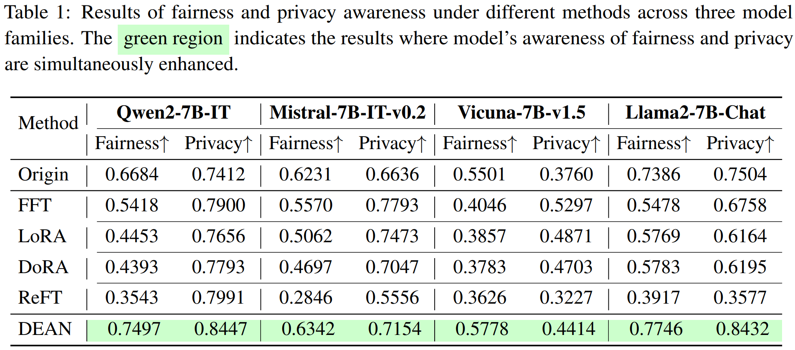

<!-- # DEAN: Deactivating the Coupled Neurons to Mitigate Fairness-Privacy Conflicts in Large Language Models -->

<div align="center">
  <h1>DEAN: Deactivating the Coupled Neurons to Mitigate Fairness-Privacy Conflicts in Large Language Models</h1>
  <br />
  <span style="color:red">📢 <strong><i>If you are interested in our work, please star ⭐ our project.</i></strong></span>

  <h4>
    <a href="https://arxiv.org/abs/2410.16672"></a>
    
    
    
  </h4>
</div>


## 🌈 Introduction


Ensuring awareness of fairness and privacy in Large Language Models (LLMs) is critical. Interestingly, we discover a counter-intuitive trade-off phenomenon that enhancing an LLM's privacy awareness through Supervised Fine-Tuning (SFT) methods significantly decreases its fairness awareness with thousands of samples. To address this issue, inspired by the information theory, we introduce a training-free method to **DEA**ctivate the fairness and privacy coupled **N**eurons (**DEAN**), which theoretically and empirically decrease the mutual information between fairness and privacy awareness. 

- Extensive experimental results demonstrate that ***DEAN eliminates the trade-off phenomenon and significantly improves LLMs' fairness and privacy awareness simultaneously***, *e.g.*, improving Qwen-2-7B-Instruct's fairness awareness by 12.2\% and privacy awareness by 14.0\%.

- More crucially, ***DEAN remains robust and effective with limited annotated data or even when only malicious fine-tuning data is available***, whereas SFT methods may fail to perform properly in such scenarios. 

We hope this study provides valuable insights into concurrently addressing fairness and privacy concerns in LLMs and can be integrated into comprehensive frameworks to develop more ethical and responsible AI systems.


##  🚩Main Results

<p style="color: #0288D1; font-size: 18px; font-weight: bold;">
    DEAN enhances LLM’s awareness of fairness and privacy simultaneously without compromising general capabilities.
</p>

<!-- DEAN enhances LLM’s awareness of fairness and privacy simultaneously without compromising general capabilities. -->




<!--  -->

<!--  -->

---
<p style="color: #0288D1; font-size: 18px; font-weight: bold;">
    DEAN remains robust even when only malicious fine-tuning data is available.
</p>

<!-- **DEAN remains robust even when only malicious fine-tuning data is available.** -->


<!--  -->

---

<p style="color: #0288D1; font-size: 18px; font-weight: bold;">
    DEAN encourages the model to produce more cautionary language related to fairness and privacy.
</p>

<!-- **DEAN encourages the model to produce more cautionary language related to fairness and privacy.** -->


<!--  -->


## 🚀Quick Start


### 🔧Requirements

The following pakages are required to run the code:

- python==3.11.5

- pytorch==2.1.2

- transformers==4.40.0

- datasets==2.18.0

### 🌟Usage

**1. Compute and save the importance score**

```bash
cd src/

datasets=(
    "beaver_train330k_privacy_safe_1k"
    "beaver_train330k_fairness_safe_1k"
    "alpaca_cleaned_no_safety"
)

for dataset in "${datasets[@]}"; do
    python compute_importance_score.py \
    --model your_model \
    --model_path your_model_path \
    --nsamples 128 \
    --dataset $dataset
done
```

**2. Run and evaluate DEAN**

```bash
cd src/

python main.py \
--model your_model \
--model_path your_model_path \
--nsamples 128 \
--dataset1 beaver_train330k_privacy_safe_1k \
--dataset2 beaver_train330k_fairness_safe_1k \
--target_module mlp \
--p 5e-7 \
--q 5e-7
```


## 📝License
Distributed under the Apache-2.0 License. See LICENSE for more information.


## Acknowledgements
Some code in this project is adapted from resources provided by the following repositories: 
- https://github.com/boyiwei/alignment-attribution-code
- https://github.com/OpenSafetyLab/SALAD-BENCH

We greatly appreciate the contributions of the original authors.


## 📖BibTeX
```
@article{qian2024dean,
  title={DEAN: Deactivating the Coupled Neurons to Mitigate Fairness-Privacy Conflicts in Large Language Models},
  author={Qian, Chen and Liu, Dongrui and Zhang, Jie and Liu, Yong and Shao, Jing},
  journal={arXiv preprint arXiv:2410.16672},
  year={2024}
}